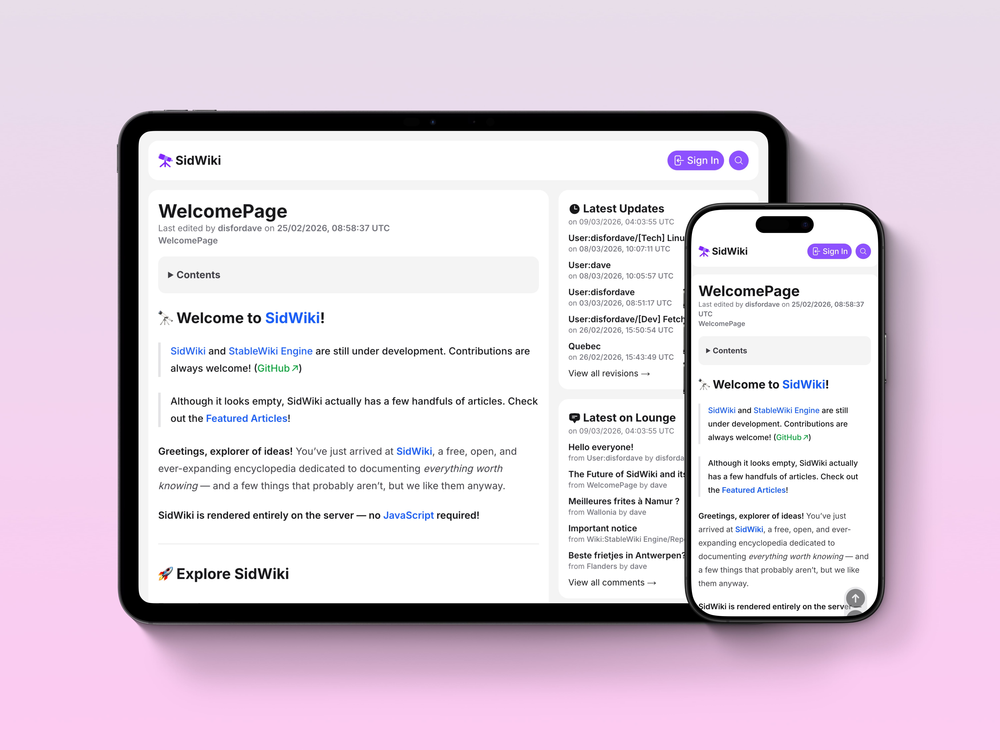

# 🔭 StableWiki Engine



🌐 **Live Demo:** [https://sidwiki.com](https://sidwiki.com)

StableWiki Engine is an open-source wiki and knowledge platform built with **Next.js, TypeScript, and PostgreSQL**.

It was originally created to replace the friction of maintaining a **Git-based Markdown blog**.
Instead of writing posts locally and pushing commits, StableWiki allows pages to be created and edited directly on the web while preserving the structure and traceability of a wiki.

The engine powers **[SidWiki](https://sidwiki.com)** — the ultimate knowledge base and blog platform that combines:

* wiki-style articles
* personal blog pages through user subpages
* lightweight community discussions via `_lounge`
* revision history and link-driven navigation

StableWiki aims to be simple, transparent, and accessible, prioritizing **Markdown editing and server-rendered content** so that the platform remains usable even without JavaScript.

---

# Core Concepts

StableWiki is built around several core ideas.

### Wiki + Blog Hybrid

StableWiki treats user pages and their subpages as blog posts while keeping regular pages as wiki articles.

Example structure:

```
User:eric
User:eric/How_to_vote_in_Quebec
JavaScript
Category:Programming
```

This allows the same system to support both:

* structured knowledge articles
* personal publishing

---

### Link-Driven Knowledge Graph

Pages are connected using wiki links.

```
[[JavaScript]]
[[Category:Member of UN]]
```

These links automatically generate:

* backlinks
* category pages

---

### Markdown-First Editing

StableWiki uses **Markdown as the primary content format**.

Pages can be edited using a simple textarea editor, ensuring that writing remains accessible even in environments where JavaScript is unavailable.

JavaScript enhancements such as search autocomplete or preview rendering are applied progressively.

---

### Progressive Enhancement

StableWiki prioritizes **server-rendered content** and accessibility.

Core functionality works without JavaScript, while optional enhancements improve the editing experience in modern browsers.

---

# Features

* Wiki page system with namespace support
* Markdown-based article editing
* Page revision history with version rollback
* User authentication and role-based permissions
* Link-driven navigation with backlinks and categories
* Redirect support using wiki syntax
* Integrated discussion via `_lounge`
* Search functionality with autocomplete
* Responsive UI for mobile and desktop

---

# Installation

To install StableWiki Engine, follow these steps.

### 1. Clone the repository

```bash
git clone https://github.com/disfordave/stablewiki.git
```

### 2. Enter the project directory

```bash
cd stablewiki
```

### 3. Install dependencies

```bash
npm install
```

### 4. Configure environment variables

Rename `.env.example` to `.env` and update the values accordingly.

### 5. Set up the database

```bash
npx prisma db push
```

### 6. Start the development server

```bash
npm run dev
```

Then open:

```
http://localhost:3000
```

---

# Configuration

`.env` contains various configuration options for StableWiki.

## App Configuration

| Variable               | Description                          |
| ---------------------- | ------------------------------------ |
| `NEXT_PUBLIC_BASE_URL` | Base URL of your StableWiki instance |
| `DATABASE_URL`         | PostgreSQL connection string         |
| `JWT_SECRET`           | Secret key used for authentication   |

---

## Wiki Information

| Variable                    | Description                    |
| --------------------------- | ------------------------------ |
| `WIKI_NAME`                 | Name of your wiki              |
| `WIKI_HOMEPAGE_LINK`        | Homepage page slug             |
| `WIKI_DESCRIPTION`          | Description shown for the wiki |
| `WIKI_COPYRIGHT_HOLDER`     | Copyright owner                |
| `WIKI_COPYRIGHT_HOLDER_URL` | URL for the copyright holder   |

---

## Feature Controls

| Variable                   | Description                |
| -------------------------- | -------------------------- |
| `WIKI_DISABLE_MEDIA`       | Disable media uploads      |
| `WIKI_MEDIA_ADMIN_ONLY`    | Restrict uploads to admins |
| `WIKI_DISABLE_SIGNUP`      | Disable user registration  |
| `WIKI_DISABLE_SYSTEM_LOGS` | Disable system logging     |

---

## Logo and Theme

| Variable            | Description            |
| ------------------- | ---------------------- |
| `WIKI_DISABLE_LOGO` | Hide the header logo   |
| `WIKI_ROUND_LOGO`   | Use rounded logo style |
| `WIKI_LOGO_URL`     | Custom logo image URL  |
| `WIKI_THEME_COLOR`  | Primary theme color    |

Available theme colors:

```
violet (default)
rose
emerald
orange
sky
indigo
yellow
pink
zinc
```

---

# Serverless Platform Notes

StableWiki relies on Node.js filesystem features for media storage.

Because of this, **persistent file uploads may not function correctly on serverless platforms**.

If your deployment environment does not support persistent storage, you can disable media uploads:

```
WIKI_DISABLE_MEDIA=true
```

---

# Roadmap

Future plans and development notes are tracked in:

[https://sidwiki.com/wiki/User:dave/[Wiki]_The_Future_of_SidWiki_and_StableWiki_Engine](https://sidwiki.com/wiki/User:dave/[Wiki]_The_Future_of_SidWiki_and_StableWiki_Engine)

---

# Contributing

Contributions are welcome.

Areas where contributions are particularly helpful:

* Serverless compatibility
* External storage support
* UI improvements
* documentation improvements

### Contribution workflow

1. Fork the repository
2. Create a branch

```
git checkout -b feature/your-feature-name
```

3. Commit your changes

```
git commit -m "Add some feature"
```

4. Push the branch

```
git push origin feature/your-feature-name
```

5. Open a pull request
 
---

# Built With

- **Next.js** — full-stack framework
- **TypeScript** — static typing
- **PostgreSQL** — relational database
- **Prisma ORM** — object-relational mapper
- **Tailwind CSS** — styling
- **TanStack Query** — data fetching (client)
- **Vitest** — unit testing

---

# License

This project is licensed under the **GNU Affero General Public License v3.0 or later (AGPL-3.0-or-later)**.

In short:

* You may freely use and modify the project.
* If you deploy the project as a service, you must also share your modifications under the same license.

See the [LICENSE](LICENSE) file for details.

---

# StableWiki in Production

StableWiki Engine currently powers:

**SidWiki**

[https://sidwiki.com](https://sidwiki.com)

The ultimate knowledge base and blog platform built using the StableWiki engine created by the [same developer](https://sidwiki.com/wiki/User:disfordave).
